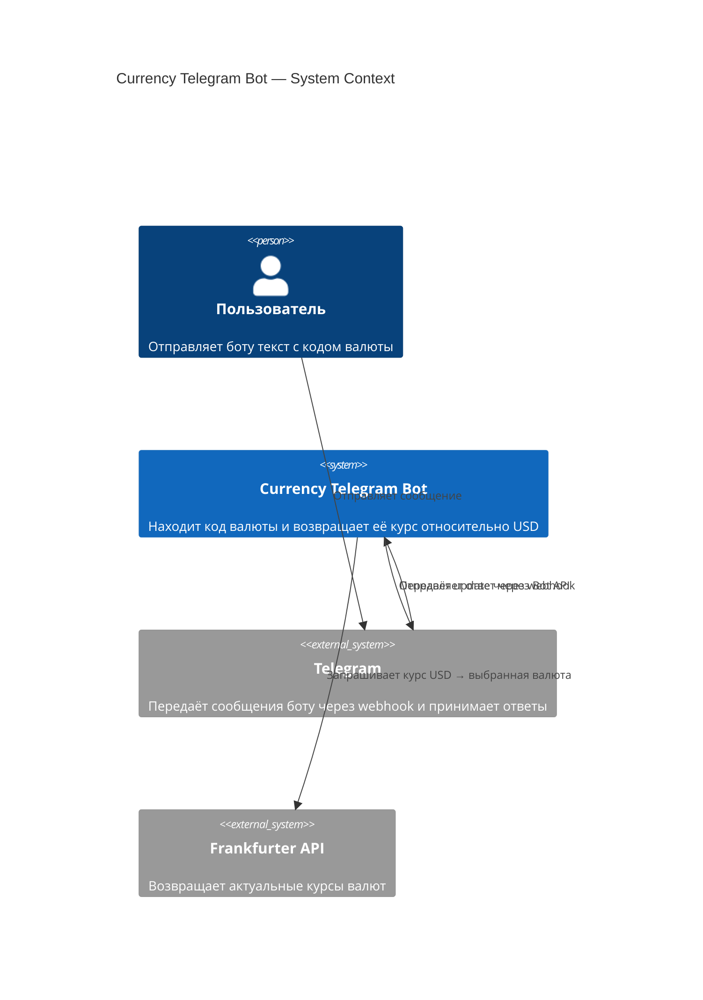
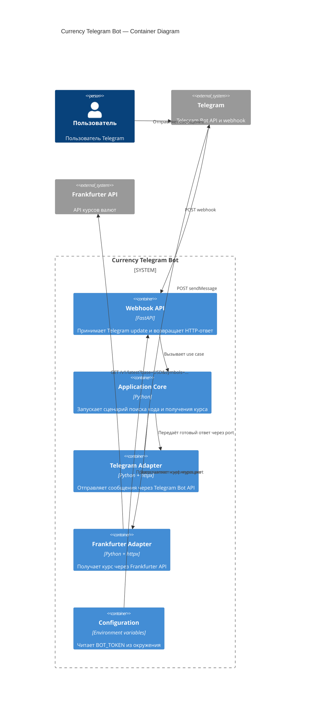
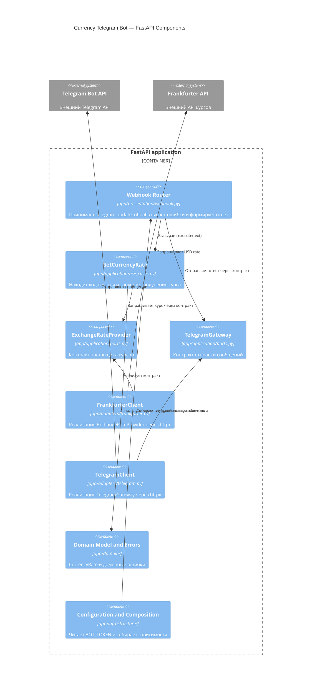

# C4 architecture

Диаграммы соответствуют текущей FastAPI-версии проекта.

## 1. Context diagram

Показывает систему в целом и её внешние взаимодействия.

## 2. Container diagram

Приложение разворачивается как один FastAPI-сервис. Внутри него выделены
логические контейнеры, которые отвечают за разные части системы.

## 3. Component diagram

Показывает компоненты внутри FastAPI-приложения и направление зависимостей.

